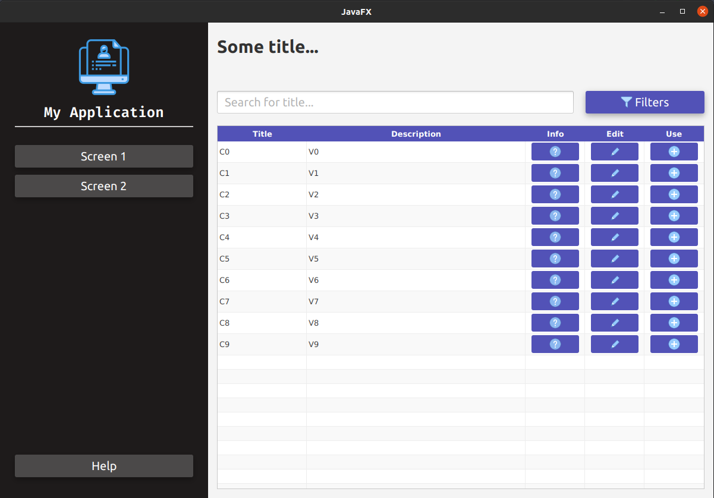

# Demo with JavaFX

Simple example with JavaFX using 2 fxml in same screen
and table with button column

## Icons

https://kordamp.org/ikonli/cheat-sheet-fontawesome5.html

## Examples

https://github.com/JavaCodeJunkie/javafx
